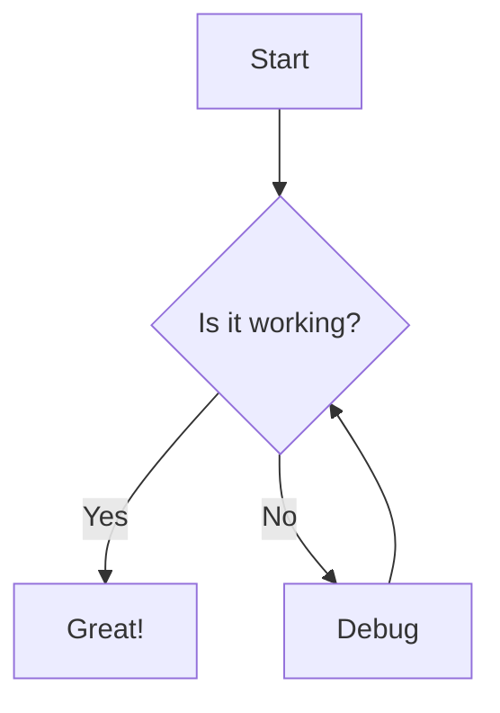

# Styling Reference Guide

This post serves as a comprehensive reference for all the markdown elements and how they appear on this blog. Use this as a template and reference when writing your posts.

## Headers

# H1 - Main Title
## H2 - Section Header
### H3 - Subsection
#### H4 - Smaller Subsection
##### H5 - Even Smaller
###### H6 - Smallest Header

## Text Formatting

Here's some **bold text** and *italic text*. You can also use __bold__ and _italic_ syntax.

You can combine them: ***bold and italic*** or **_bold and italic_**.

Here's some `inline code` that stands out from regular text.

## Links

Here's a [regular link](https://github.com) and here's a [visited link](https://google.com) (if you've clicked it before).

## Lists

### Unordered Lists
- First item
- Second item
  - Nested item
  - Another nested item
- Third item

### Ordered Lists
1. First numbered item
2. Second numbered item
   1. Nested numbered item
   2. Another nested item
3. Third numbered item

## Blockquotes

> This is a blockquote. It's great for highlighting important information or quotes from other sources.
> 
> Blockquotes can span multiple paragraphs and look quite elegant with the current styling.

## Code Blocks

Here's a JavaScript code block:

```javascript
function greetUser(name) {
    console.log(`Hello, ${name}!`);
    return `Welcome to the blog, ${name}`;
}

const user = "Developer";
greetUser(user);
```

Here's a Python code block:

```python
def calculate_fibonacci(n):
    if n <= 1:
        return n
    return calculate_fibonacci(n-1) + calculate_fibonacci(n-2)

# Generate first 10 Fibonacci numbers
for i in range(10):
    print(f"F({i}) = {calculate_fibonacci(i)}")
```

Here's some CSS:

```css
.example-class {
    color: #333;
    font-size: 16px;
    margin: 10px 0;
    transition: all 0.3s ease;
}

.example-class:hover {
    color: #0366d6;
}
```

## Images

If you add images to your posts, they should be responsive and look good:


*Caption: Images automatically scale to fit the content width*

## Tables

| Feature | Supported | Notes |
|---------|-----------|-------|
| Headers | ✅ | All 6 levels |
| Links | ✅ | With hover effects |
| Code blocks | ✅ | Syntax highlighting |
| Lists | ✅ | Nested support |
| Images | ✅ | Responsive |

## Horizontal Rules

You can add horizontal rules to separate sections:

---

## Mixed Content Example

Here's a practical example mixing different elements:

### Step-by-Step Guide

1. **Setup**: First, you need to configure your environment
   ```bash
   npm install
   npm start
   ```

2. **Configuration**: Edit your config file:
   - Set `debug: true` for development
   - Update the `baseUrl` setting
   - Add your API keys

3. **Testing**: Run the test suite
   > **Note**: Make sure all tests pass before deploying

4. **Deployment**: Use the deployment script:
   ```javascript
   const deploy = require('./deploy');
   deploy.run();
   ```

### Important Links
- [Documentation](https://example.com/docs)
- [GitHub Repository](https://github.com/example/repo)
- [Issue Tracker](https://github.com/example/repo/issues)

## Typography Examples

This paragraph demonstrates the readability of body text. The line height and color have been optimized for comfortable reading. Lorem ipsum dolor sit amet, consectetur adipiscing elit, sed do eiusmod tempor incididunt ut labore et dolore magna aliqua.

**Key points to remember:**
- Text is readable with good contrast
- Links have subtle hover effects
- Code stands out appropriately
- Headers create clear hierarchy

## Special Characters and Symbols

You can use various symbols and special characters:

- Arrows: → ← ↑ ↓
- Checkmarks: ✅ ✓ ❌ ❎
- Stars: ⭐ ★ ☆
- Math: ≤ ≥ ≠ ± ∞
- Currency: $ € £ ¥

## Advanced Elements

### Task Lists
- [x] Completed task
- [x] Another completed task
- [ ] Pending task
- [ ] Another pending task

### Definition Lists
Term 1
: Definition for term 1

Term 2
: Definition for term 2
: Another definition for term 2

### Footnotes
Here's a sentence with a footnote[^1].

And here's another sentence with a footnote[^note].

[^1]: This is the first footnote.
[^note]: This is a named footnote with more detailed explanation.

### Keyboard Keys
Press <kbd>Ctrl</kbd> + <kbd>C</kbd> to copy.
Use <kbd>Cmd</kbd> + <kbd>V</kbd> on Mac to paste.

### Abbreviations
*[HTML]: HyperText Markup Language
*[CSS]: Cascading Style Sheets

The HTML and CSS specifications are important for web development.

### Strikethrough Text
~~This text is crossed out~~ but this text is normal.

### Superscript and Subscript
E = mc<sup>2</sup>
H<sub>2</sub>O is water.

### Highlighted Text
Use ==highlighted text== to draw attention to important points.

### Line Breaks and Spacing
This line has two spaces at the end  
So this line starts on a new line.

But this line doesn't have spaces
So it continues on the same line.

### Details/Summary (Collapsible Content)
<details>
<summary>Click to expand</summary>

This content is hidden by default and only shown when you click the summary.

You can put any markdown content here:
- Lists
- **Bold text**
- Code blocks
- Links

```javascript
console.log("Hidden code!");
```

</details>

### Mathematical Expressions
You can write inline math like $E = mc^2$ or block math:

$$
\sum_{i=1}^{n} x_i = x_1 + x_2 + \cdots + x_n
$$

### Alerts/Callouts (GitHub Style)
> [!NOTE]  
> Useful information that users should know, even when skimming content.

> [!TIP]
> Helpful advice for doing things better or more easily.

> [!IMPORTANT]  
> Key information users need to know to achieve their goal.

> [!WARNING]  
> Urgent info that needs immediate user attention to avoid problems.

> [!CAUTION]
> Advises about risks or negative outcomes of certain actions.

### Custom Callouts (Using HTML)
<div style="border-left: 4px solid #0366d6; padding: 12px; margin: 16px 0; background-color: #f1f8ff;">
<strong>📘 Info:</strong> This is a custom info callout using HTML and inline styles.
</div>

<div style="border-left: 4px solid #28a745; padding: 12px; margin: 16px 0; background-color: #f0fff4;">
<strong>✅ Success:</strong> This indicates something completed successfully.
</div>

<div style="border-left: 4px solid #ffc107; padding: 12px; margin: 16px 0; background-color: #fffdf0;">
<strong>⚠️ Warning:</strong> This draws attention to important warnings.
</div>

<div style="border-left: 4px solid #dc3545; padding: 12px; margin: 16px 0; background-color: #fff5f5;">
<strong>❌ Error:</strong> This indicates an error or critical issue.
</div>

### Reference-Style Links
This is [an example][1] reference-style link.
You can also use [this format][link text].

[1]: https://example.com "Optional Title"
[link text]: https://github.com "GitHub"

### Auto-Links
<https://github.com>
<email@example.com>

### Embedded HTML
<center>This text is centered using HTML</center>

<mark>This text is highlighted</mark>

<small>This text is smaller</small>

### Emoji Support
You can use emojis! :smile: :rocket: :heart: :thumbsup:

Or use Unicode emojis directly: 😀 🚀 ❤️ 👍

### Code with Line Numbers (if supported)
```javascript {.line-numbers}
function complexFunction() {
    const data = fetchData();
    const processed = processData(data);
    return processed;
}
```

### Mermaid Diagrams (if supported)


### Conclusion

This reference post shows how all the different markdown elements render with your current styling. The design is clean, readable, and professional. Feel free to copy and modify any of these examples for your own posts!

**Elements covered:**
- Basic markdown (headers, text, lists, links)
- Code blocks and inline code
- Tables and blockquotes
- Advanced elements (task lists, footnotes, callouts)
- HTML enhancements
- Special formatting options

---

*This post will be updated as new styling features are added to the blog.*
